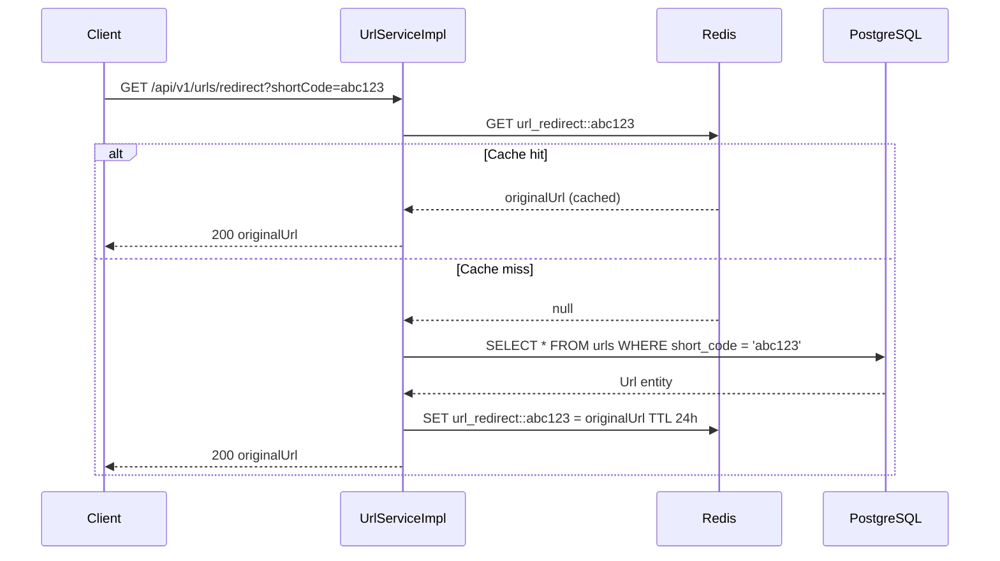
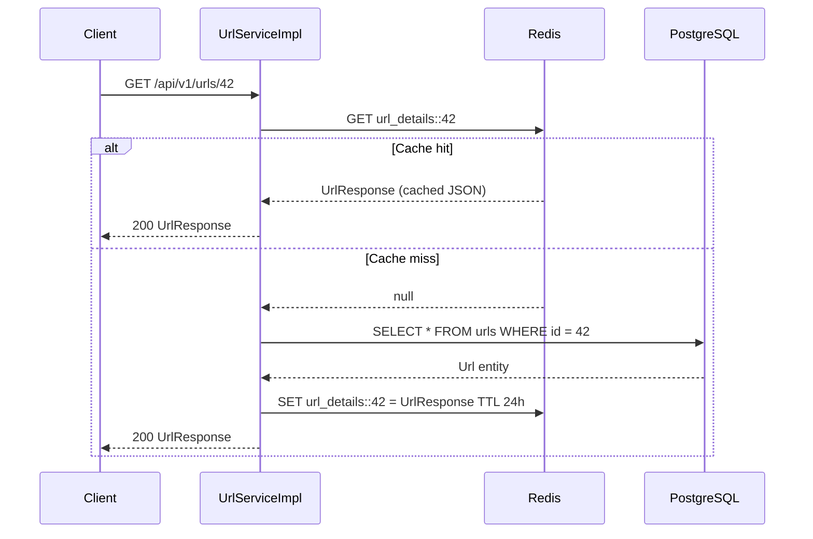
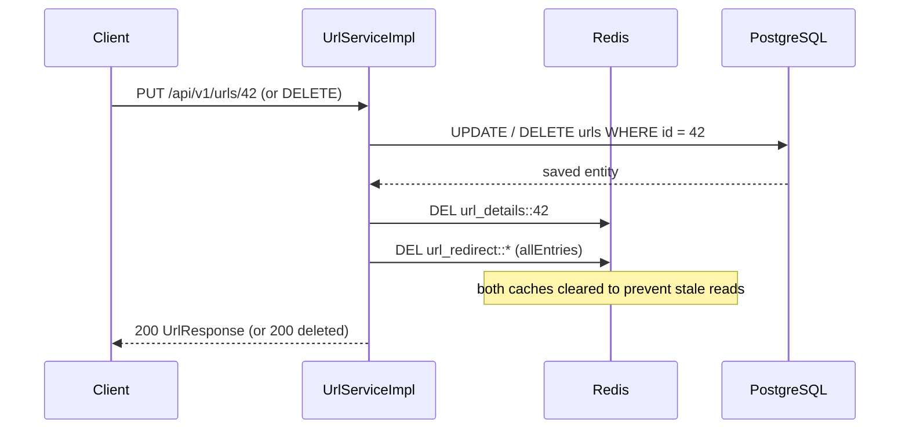

# Shorter URL

A production-ready URL shortening service built with Spring Boot 3.5 and Java 17. Supports custom aliases, bulk import via Excel, AWS S3 integration, Redis caching, and async Spring Batch processing.

## Features

- Shorten URLs with obfuscated Base62-encoded short codes
- Custom aliases (e.g. `/my-link`) with uniqueness enforcement
- URL expiry with `410 Gone` on expired links
- Optional metadata: description, tags
- Bulk import via `.xlsx` file through async Spring Batch pipeline
- AWS S3 presigned URL upload/download flow
- Redis caching for redirect lookups (24h TTL)
- Paginated URL listing and full CRUD
- Actuator health endpoint with custom S3 health indicator
- Liquibase-managed schema migrations

## Prerequisites

| Tool       | Version  |
|------------|----------|
| Java       | 17+      |
| Maven      | 3.8+     |
| PostgreSQL | 14+      |
| Redis      | 6+       |
| AWS S3     | —        |

## Getting Started

### 1. Clone the repository

```bash
git clone https://github.com/hieuhoang26/shorter-url.git
cd shorter-url
```

### 2. Create the database

```sql
CREATE DATABASE shorter_url;
```

### 3. Configure environment variables

| Variable         | Description              | Default                  |
|------------------|--------------------------|--------------------------|
| `AWS_ACCESS_KEY` | AWS access key ID        | *(set in application.yaml)* |
| `AWS_SECRET_KEY` | AWS secret access key    | *(set in application.yaml)* |
| `REDIS_HOST`     | Redis hostname           | `localhost`              |
| `REDIS_PORT`     | Redis port               | `6379`                   |
| `REDIS_PASSWORD` | Redis password           | *(empty)*                |

Update `src/main/resources/application.yaml` for database credentials and S3 bucket name.

### 4. Run the application

```bash
./mvnw spring-boot:run
```

The server starts on `http://localhost:8080`.

## Build & Test

```bash
./mvnw clean package          # Build JAR
./mvnw test                   # Run all tests
./mvnw test -Dtest=ClassName  # Run a single test class
```

## API Reference

All responses follow the `ApiResponse<T>` envelope:

```json
{
  "data": { ... },
  "message": "...",
  "success": true
}
```

### URL Endpoints — `POST /api/v1/urls`

| Method | Path                          | Description                        |
|--------|-------------------------------|------------------------------------|
| POST   | `/api/v1/urls`                | Create a short URL                 |
| GET    | `/api/v1/urls`                | List all URLs (paginated)          |
| GET    | `/api/v1/urls/{id}`           | Get URL by ID                      |
| PUT    | `/api/v1/urls/{id}`           | Update a URL                       |
| DELETE | `/api/v1/urls/{id}`           | Delete a URL                       |
| GET    | `/api/v1/urls/redirect`       | Redirect: `?shortCode=abc123`      |
| GET    | `/api/v1/urls/template`       | Download bulk import template      |

**Create URL request body:**

```json
{
  "originalUrl": "https://example.com/very/long/path",
  "customAlias": "my-link",
  "description": "Optional description",
  "tags": "tag1,tag2",
  "expiredAt": "2026-12-31T23:59:59"
}
```

### Bulk Import — `/api/v1/bulk`

| Method | Path                        | Description                        |
|--------|-----------------------------|------------------------------------|
| POST   | `/api/v1/bulk`              | Start async bulk import from S3    |
| GET    | `/api/v1/bulk/{batchId}`    | Poll batch status and progress     |

**POST request body:**

```json
{
  "objectUrl": "https://s3.../file.xlsx",
  "fileName": "import.xlsx"
}
```

**Bulk import flow:**
1. Upload `.xlsx` to S3 using a presigned URL (`POST /api/v1/storage/presigned-url`)
2. Submit the S3 object path to `POST /api/v1/bulk` → returns `batchId`
3. Poll `GET /api/v1/bulk/{batchId}` until status is `COMPLETED`

### Storage — `/api/v1/storage`

| Method | Path                              | Description                        |
|--------|-----------------------------------|------------------------------------|
| POST   | `/api/v1/storage/presigned-url`   | Generate a presigned PUT/GET URL   |
| GET    | `/api/v1/storage/verify`          | Verify S3 object exists            |

### Health

```
GET /actuator/health
```

Includes custom S3 connectivity indicator.

## Batch Processing

Bulk URL import is handled by a Spring Batch pipeline running asynchronously on a dedicated thread pool (`batchExecutor`, core=2, max=5). Each job is identified by a UUID `batchId` and its progress can be polled at any time.

### Pipeline: Reader → Processor → Writer

```
S3 (.xlsx file)
     │
     ▼
UrlExcelItemReader       downloads file once from S3, caches bytes in memory,
                         iterates rows via Apache POI, emits UrlRowDTO per row
     │
     ▼
UrlBatchItemProcessor    validates each URL (must be http/https),
                         emits ProcessedUrlRow with status PENDING or FAILED
     │
     ▼
UrlBatchItemWriter       partitions chunk into FAILED / PENDING groups,
                         runs 4 batch saveAll() calls per chunk (not per row)
     │
     ▼
PostgreSQL (urls + url_file_batch_records tables)
```

### Fault tolerance

The step is configured with `faultTolerant().skip(Exception.class)` — bad rows are individually skipped rather than aborting the job. Up to `app.batch.skip-limit` (default 1000) rows may be skipped before the job fails.

### Upsert / deduplication logic (Writer)

The writer avoids duplicate URLs across a chunk using two bulk lookups per chunk (not per row), then classifies each row:

| Case | Condition | Action |
|------|-----------|--------|
| A    | Same `originalUrl`, no alias — record already exists | Reuse existing short code, write SUCCESS record |
| B    | Same `originalUrl` + same `customAlias` — record already exists | Reuse existing short code, write SUCCESS record |
| C    | Different `originalUrl`, alias already taken by another URL | Write FAILED record with error message |
| D    | Brand new URL (no existing match) | Insert new `Url` row, generate short code, write SUCCESS record |

For **Case D**, the writer uses a two-step flush pattern to obtain DB-assigned IDs before generating Base62 short codes:

```
saveAllAndFlush(urls)           ← flush assigns auto-increment IDs
generateShortCode(url.getId())  ← Base62 encoding of the ID
saveAll(urls)                   ← update short codes in one batch
```

This reduces DB round-trips from `4 × N` per chunk to a constant **4 batch operations** per chunk regardless of chunk size.

### Job lifecycle (UrlBatchJobListener)

`UrlBatchJobListener` implements both `JobExecutionListener` and `StepExecutionListener`:

| Hook | What it does |
|------|--------------|
| `beforeJob` | Stamps `startedAt` on the `UrlFileBatches` record |
| `afterStep` | Logs read/write/skip counts per step in real time |
| `afterJob` | Counts SUCCESS and FAILED records, sets final `BatchStatus`, stamps `completedAt` |

Final job status resolves as:

- `COMPLETED` — all rows succeeded
- `PARTIAL_SUCCESS` — at least one row failed but job did not abort
- `FAILED` — Spring Batch itself reported `FAILED` status

### Batch status response

```json
{
  "batchId": "550e8400-e29b-41d4-a716-446655440000",
  "status": "COMPLETED",
  "totalRecords": 500,
  "processedRecords": 500,
  "successRecords": 497,
  "failedRecords": 3,
  "startedAt": "2026-04-20T10:00:00Z",
  "completedAt": "2026-04-20T10:00:12Z"
}
```

### Tuning parameters

| Property | Default | Description |
|----------|---------|-------------|
| `app.batch.chunk-size` | `100` | Rows per DB transaction |
| `app.batch.skip-limit` | `1000` | Max skippable rows before job failure |

---

## Redis Caching

Caching is powered by Spring Cache with a Redis backend. The `CacheManager` is configured in `RedisConfig` with:

- **Serialization**: `GenericJackson2JsonRedisSerializer` with `JavaTimeModule` — values stored as typed JSON (includes `@class` metadata for polymorphic deserialization)
- **Key serialization**: `StringRedisSerializer` — human-readable keys in Redis
- **Default TTL**: `cache.ttl-hours` (default `24` hours)
- **Null values**: disabled — cache misses always fall through to the database

### Cache regions

| Cache name | Key | Populated by | Evicted by |
|------------|-----|--------------|------------|
| `url_redirect` | `shortCode` string | `redirect(shortCode)` on first lookup | `update` / `delete` — `allEntries = true` |
| `url_details` | `id` long | `getById(id)` on first lookup | `update` / `delete` by ID key |

---

### Flow 1 — Cache hit (`redirect`)



---

### Flow 2 — Cache hit (`getById`)



---

### Flow 3 — Cache eviction on `update` / `delete`



`url_redirect` uses `allEntries = true` because updating a URL may change its `shortCode` (e.g. new custom alias), making targeted key eviction unsafe.

---

### Cache annotation summary

```java
@Cacheable(value = "url_redirect", key = "#code")       // redirect()
@Cacheable(value = "url_details",  key = "#id")         // getById()

@Caching(evict = {
    @CacheEvict(value = "url_details",  key = "#id"),
    @CacheEvict(value = "url_redirect", allEntries = true)
})                                                       // update() and delete()
```

### Redis connection

```yaml
spring.data.redis:
  host: ${REDIS_HOST:localhost}
  port: ${REDIS_PORT:6379}
  password: ${REDIS_PASSWORD:}   # leave blank if no auth
```

---

## Configuration Reference

Key properties in `application.yaml`:

```yaml
spring.datasource.url: jdbc:postgresql://localhost:5432/shorter_url
aws.s3.bucket: <your-bucket>
aws.s3.region: ap-southeast-1
cache.ttl-hours: 24
app.batch.chunk-size: 100
app.batch.skip-limit: 1000
app.shortener.min-length: 6
```

## Architecture

```
controller/       REST layer (UrlController, BulkController, ObjectStorageController)
service/impl/     Business logic (UrlServiceImpl, BulkUrlServiceImpl, ObjectStorageServiceImpl)
batch/            Spring Batch pipeline (Reader → Processor → Writer)
model/            JPA entities (Url, UrlFileBatches, UrlFileBatchRecords)
dto/              Request/response objects
mapper/           MapStruct entity↔DTO mappers
exception/        GlobalExceptionHandler + custom exceptions
common/           ApiResponse<T> wrapper, AuditConfig
config/           RedisConfig, AsyncConfig, batch job config
```

Schema migrations live in `src/main/resources/db/changelog/` and are managed by Liquibase.

## License

This project is licensed under the MIT License.
